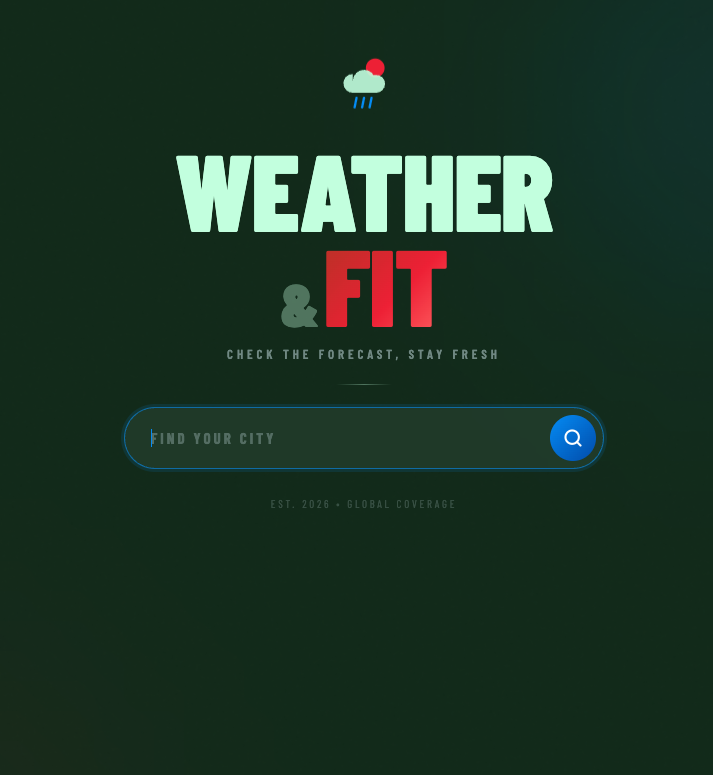
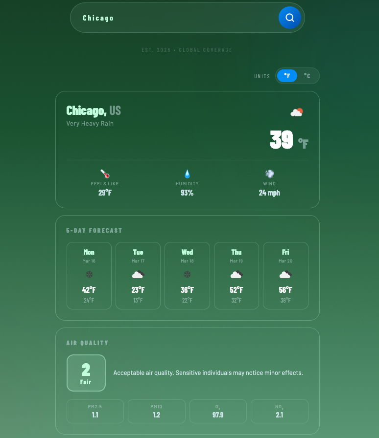
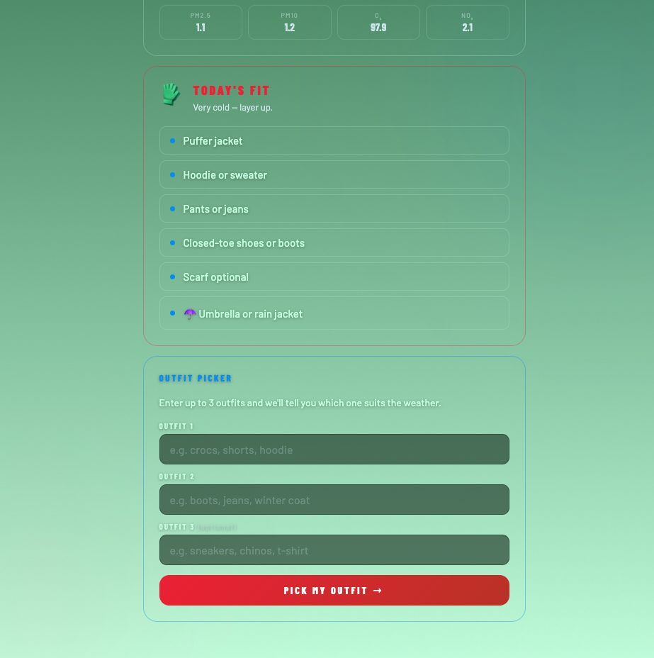

# 🌤️ Weather & Fit

A full-stack weather app that gives you real-time weather data and outfit recommendations based on current conditions.


## Features
- 🔍 Search any city worldwide !
- 🌡️ Real-time temperature with °F / °C toggle
- 💧 Humidity, wind speed, and feels-like temperature
- 📈 Hourly temperature chart for today
- 📅 5-day forecast
- 🌿 Air quality index with pollutant breakdown
- 👗 Clothing recommendations based on weather conditions
- 👔 Outfit picker — enter up to 3 outfits and get a recommendation !

## Tech Stack
| Layer | Technology |
|---|---|
| Backend | Python 3.11, Flask |
| Frontend | HTML5, CSS3, JavaScript |
| Database | MySQL |
| API | OpenWeatherMap |
| Chart | Chart.js |

## Setup

### 1. Clone the repo
```bash
git clone https://github.com/irene-cj/weather-fit.git
cd weather-fit
```

### 2. Install dependencies
```bash
pip3 install -r requirements.txt
```

### 3. Get a free API key
Sign up at [openweathermap.org](https://openweathermap.org/api) and copy your API key.

### 4. Configure environment variables
Add your values to the `.env` file:
```
WEATHER_API_KEY=your_key_here
```

### 5. Run the app
```bash
python3.11 app.py
```

Open [http://127.0.0.1:5000](http://127.0.0.1:5000) in your browser.

## Screenshots

📸 Home



---

📸 Forecast



---

📸 Fits

